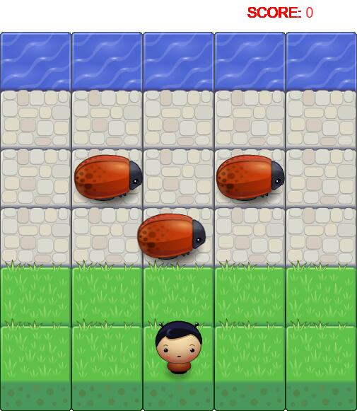

# Frontend-nanodegree-arcade-game
This is a project that contains a mini game. In this game, you will control a character and want to reach the water. The character can move left, right, up and down. But be caution with the bugs. The bugs move in varying speeds on the paved block portion of the scene. Once a the player collides with an enemy, the game is reset and the player moves back to the start square. Once the player reaches the water the game is won.

## Download
Download the whole project [here](https://github.com/orange9320/frontend-nanodegree-arcade-game), including 4 folders (1 of hidden) and 2 files at root folder. They are:
- Files:
 - README.md
 - index.html
- Folders:
 - css
 - images
 - js:
 - .git (hidden and optional)

## Start
To start the game, simply open the index.html file in the browser. Chrome or Firefox could be better. If any version browser doesn't work, please contact [me](mailto:fakeEmail@fakeEmail.com).

## Control
- Press ↑ to move up
- Press ↓ to move down
- Press ← to move left
- Press → to move right
- Press Space to switch character

## Score and Difficult
Every time the character reach the river, you can win a score.  
Every time the character collides with a bug, you lose a score.  
Every 2 scores earned will make one additional bug -- This new bug may move faster than previous ones.  
Every 2 scores lost will remove the fasters bug in current play groud.

## Contact me
If there's any problem, please contact [me](mailto:fakeEmail@fakeEmail.com).
